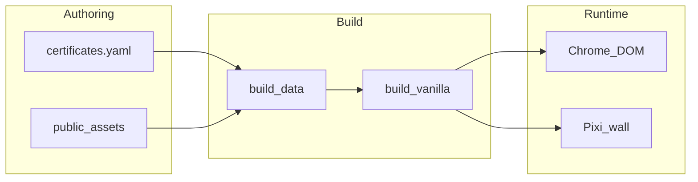

# System design — Certificate Wall

Canonical **why** for this application. For constants, formulas, and tick order see [architecture.md](./architecture.md). For catalog/build mechanics see [data-and-pipeline.md](./data-and-pipeline.md). For public-safe ICP → UI mapping see [icp-surface-map.md](./icp-surface-map.md).

## Primordial constraint

**Job to be done:** Present inspectable credentials to discretionary buyers (AI scaleup FDE buyers and technical venture operators) on a public static site (`https://kartavya.tech/certifications/`), without becoming an HR/ATS page or a vanity gallery.

| Principle | Consequence |
|-----------|-------------|
| Proof > pedigree | Panel exposes `credentialId`, `verifyUrl`, summary, tags |
| Static hosting | No server runtime; build-time data; CDN-friendly assets |
| Operator-grade system | Deterministic pipelines; explicit backlog; no silent scope |
| Cold visit must feel light | Defer GPU until Enter; progressive textures |
| Scale later (10 → hundreds) | Spatial index + pools now; do not DOM-render the wall |

## Three planes

1. **Authoring** — humans edit one YAML file and optional images under `public/assets/`.
2. **Build** — validate, autofill layout, emit `wall.json` + JSON-LD, assemble `site/`.
3. **Runtime** — DOM for chrome / splash / proof panel; Pixi for the infinite wall.

Content changes must not require rewriting the engine. Engine work must not require a backend.

## Data layer

- **Single edit surface:** [`certificates.yaml`](../certificates.yaml).
- **Build outputs:** `generated/wall.json` → `site/data/wall.json`; JSON-LD + meta injected into `site/index.html` (crawlers never need YAML).
- **Layout autofill:** missing `x/y/width/height/angle` filled with a PRNG seeded by `id` — stable across builds.
- **Images (no-PDF default):** YAML `image:` URL, or `public/assets/<id>.{png,jpg,webp}` (local file wins).
- **PDF→PNG:** optional scripts / optionalDependencies only; not on the default CI path ([BACKLOG-PDF-03](./backlog.md)).
- **Safety:** `verifyUrl` is `https:` or `#`; panel copy uses text nodes, not raw HTML.

## GPU wall

### Why not DOM for cards

Per-card DOM + CSS transforms do not scale past dozens of seam repeats. Wall content is Pixi (WebGPU preferred, WebGL2 fallback). DOM keeps dock, splash, selection panel, and a11y live regions.

### Coordinate model

- Pieces live **once** in a finite TILE (`5200×3600`).
- Camera is **infinite**.
- Seams use modulo / tile indices `(i,j)`. Infinity is a **projection**, not unbounded data.

### Spatial hash and pools

- Query AABBs near the viewport (hash cell ~384); torus queries split into TILE-local rects.
- **Sprite pool:** only visible `(piece, tileOffset)` instances.
- **Texture pool (N≈96, lower on weak devices):** recycle slots so pan does not unbounded-allocate GPU memory.

### Physics and input

| Problem | Choice |
|---------|--------|
| 60 Hz vs 144 Hz | \(v \propto (1-f)^{\Delta t}\), clamped `dt` |
| Focus without ringing | Critically damped spring (\(\zeta = 1\)); no tween library |
| Focus context | Frosted-glass edge veil eases in after the spring leads, eases out faster on pan/close |
| Float precision jitter | Origin shift past threshold |
| Trackpad vs mouse wheel | Normalize discrete ticks |
| Pinch | Touch distance vs `wheel` + `ctrlKey` (never both) |
| Idle motion | Stationary until pointer; drift tied to pointer with ease in/out |
| Select | Always spring-focus the credential |
| Recenter | Zoom-out overview, then cycle setpoints |

### Cold start

Chrome paints first. Pixi initializes on splash **Enter**. Low-end: lower DPR, smaller pool, no antialias.

## Theming and brand

- CSS tokens on `data-theme` × `data-mode`; Motif dark hex frozen as default ([architecture.md](./architecture.md)).
- `theme.js` pushes computed vars into Pixi clear / default mats so chrome and wall stay coherent.
- **Editorial pairing:** Satoshi for headlines, labels and interface; Newsreader (transitional serif, optical sizing) for reading copy — splash dek, record byline and summary, shortcut descriptions, canvas plate bylines. Both self-hosted woff2 under `public/fonts/`.
- Chrome motion is CSS only (`@starting-style`, `allow-discrete`, `@property`); no GSAP.
- Content is a static snapshot. Records enter through the data layer (`certificates.yaml` + `public/assets/`), never through the page — there is no add, upload or rearrange affordance.
- Signal-sweep blobs and the splash accent glow are removed — noise against a proof wall.

## Deploy and ops

| Choice | Rationale |
|--------|-----------|
| GitHub Pages + Actions | Static artifact; custom domain on `kartavya.tech` |
| Relative paths (`./`) | Works under `/certifications/` |
| `site/` gitignored | Always rebuilt; no stale Pages junk |
| No Vite | Single vanilla story |
| LICENSE split | Code with attribution; personal certs not for imitation |

## Explicit non-choices

Anything not IN-SPRINT is either **NEVER** or a **BACKLOG-*** id — see [backlog.md](./backlog.md). Highlights:

- No hang-an-image on the public wall
- No HR / CV primary CTA
- No ambient idle drift; no per-frame `velocity *= 0.95`
- No confidential GTM salary/visa copy on Pages
- Graph / search / OCR / audit CTA deferred

## System thesis

A build-time credential catalog drives a GPU infinite wall and a DOM proof panel on static hosting — optimized for buyer inspection, frame-rate-correct feel, and bounded memory — not for CMS editing or HR distribution.
